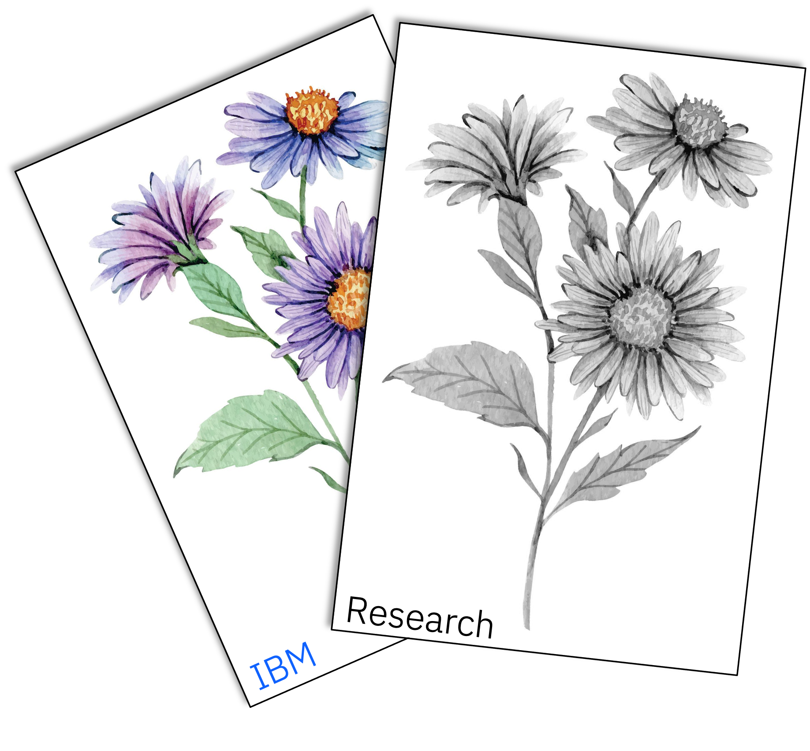

[//]: # ([![Build Status]&#40;&#41;]&#40;&#41; )
[](https://www.python.org/downloads/release/python-3110/)
<h3 align="center">ASTER-NL2Test: [A]utomated Natural Language to Te[s][t] Cas[e] Generato[r] </h3>
<p align="center">

</p>

### 👋 Overview

### 💽 Usage
```angular2html
poetry install
poetry shell
```